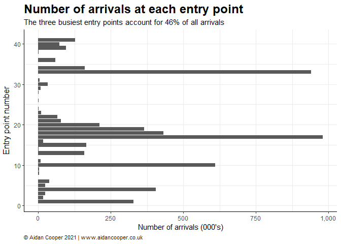
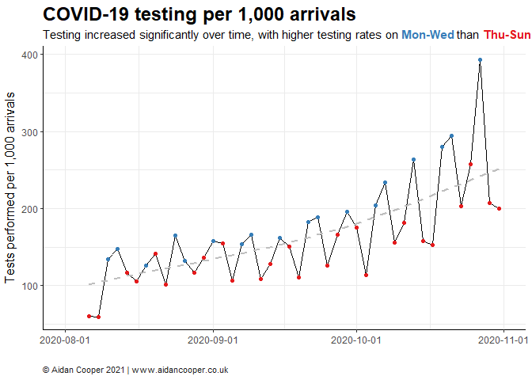

## Background and Data

Research paper: [Efficient and targeted COVID-19 border testing via reinforcement learning](https://www.nature.com/articles/s41586-021-04014-z_reference.pdf)

Data sources:

 * [Greece border testing](https://github.com/kimondr/EVA_Public_Data)


```r
# load data
df <- read_csv(here("data", "greece_eva.csv")) %>%
  separate(epoch_dates, sep = "/", into = c("epoch_start", "epoch_end")) %>%
  select(-c(epoch, epoch_end)) %>%
  mutate(
    epoch_start = as.Date(epoch_start),
    point_entry = str_split(point_entry, pattern="_") %>% sapply(extract, 2) %>% as.numeric()
  )
slice_sample(df, n=10)
```

```
## # A tibble: 10 x 7
##    epoch_start point_entry country numSchedArrivals numTestsPerformed
##    <date>            <dbl> <chr>              <dbl>             <dbl>
##  1 2020-10-17           33 IL                    58                 0
##  2 2020-09-23           36 IT                   450                 8
##  3 2020-09-03           39 BG                   312                 0
##  4 2020-08-26            3 DE                    64                 0
##  5 2020-08-16            2 DE                    36                 0
##  6 2020-09-07           33 BE                   484                 0
##  7 2020-08-16           33 FI                   186               164
##  8 2020-09-01           34 NO                    56                38
##  9 2020-09-23           34 LT                    52                50
## 10 2020-09-29            4 NL                   554               394
## # ... with 2 more variables: numPositivesFound <dbl>, numTestsAlloc <dbl>
```


```r
point_entry_nums <- sort(unique(df$point_entry))
paste(c(length(point_entry_nums), "entry points:", point_entry_nums), collapse=" ")
```

```
## [1] "38 entry points: 1 2 3 4 5 6 8 9 10 11 12 13 14 15 16 17 18 19 20 21 22 23 24 25 26 27 28 29 30 31 33 34 36 37 38 39 40 41"
```

There are 38 entry points, numbered from 1-41, with numbers 7, 32, and 35 not observed in the data.


```r
# identify countries with at least 100,000 arrivals in Greece
countries <- df %>% 
  select(c(country, numSchedArrivals)) %>% 
  group_by(country) %>% 
  summarise(n_arrivals = sum(numSchedArrivals)) %>% 
  filter(n_arrivals > 100000) %>% 
  pull(country)
# create filtered dataset for only countries with at least 100k arrivals
df_100k <- df %>% filter(country %in% countries)
paste(c(length(countries), "countries have at least 100,000 arrivals in Greece:", countries), collapse=" ")
```

```
## [1] "15 countries have at least 100,000 arrivals in Greece: AL AT BE BG CH CY CZ DE FR GB IT NL Other PL RO"
```


```r
df_heatmap <- df_100k %>%
  select(country, point_entry, numSchedArrivals) %>%
  group_by(country, point_entry) %>% 
  summarise(n_arrivals = sum(numSchedArrivals)) %>% 
  group_by(country) %>% mutate(n_arrivals = n_arrivals / sum(n_arrivals) * 100)
```

```
## `summarise()` has grouped output by 'country'. You can override using the `.groups` argument.
```

```r
df_heatmap
```

```
## # A tibble: 292 x 3
## # Groups:   country [15]
##    country point_entry n_arrivals
##    <chr>         <dbl>      <dbl>
##  1 AL                1     0.137 
##  2 AL                3     2.83  
##  3 AL               17     5.59  
##  4 AL               33     0.0960
##  5 AL               40    33.3   
##  6 AL               41    58.1   
##  7 AT                1     0.152 
##  8 AT                3     0.169 
##  9 AT                4     9.27  
## 10 AT                6     1.83  
## # ... with 282 more rows
```

```r
f <- df_heatmap %>% ggplot(aes(x=country, y=point_entry, fill=n_arrivals)) + 
  geom_tile() +
  labs(
    title = "Entry points for each country",
    subtitle = paste(
      "Each country's percentage of arrivals at different Greek entry points varies considerably"
    ),
    x = "Origin country",
    y = "Entry point number",
    fill = "% arrivals",
    caption = "© Aidan Cooper 2021 | www.aidancooper.co.uk"
  ) +
  theme(
    plot.title = element_text(face = "bold", size = 18),
    plot.subtitle = element_markdown(),
    plot.caption = element_text(hjust = 0, size = 8,  colour = "#222222"),
    axis.title.y = element_text(vjust = 2, size = 12),
    panel.grid.major = element_line(),
    panel.grid.minor = element_line()
  )
ggsave("../figures/entry_points_heatmap.png", width = width, height = height)
f
```

<!-- -->

The majority of arrivals from Bulgaria - Greece's neighbour - are at entry point number 1. The only other top 15 country with a notable proportion of arrivals at this entry point is Romania - presumably from tourists driving through Bulgaria. Similarly, neighbouring Albania also has most of its arrivals at entry point number 41, which barely features for any other top 15 country in the data set.

Entry point 17 is the only one with arrivals from all of the top 15 countries.


```r
df_entry <- df_100k %>%
  select(-c(country, epoch_start)) %>%
  group_by(point_entry) %>%
  summarise(across(everything(), list(sum))) %>%
  mutate(
    tests_per_1000arrival = numTestsPerformed_1 / numSchedArrivals_1 * 1000,
    positives_per_1000test = numPositivesFound_1 / numTestsPerformed_1 * 1000,
    n_1000arrivals = numSchedArrivals_1 / 1000,
    n_tests = numTestsPerformed_1,
  ) %>%
  select(c("point_entry", "n_1000arrivals", "n_tests", "tests_per_1000arrival", "positives_per_1000test")) %>%
  arrange(desc(n_1000arrivals))
top3_percent <- sum(df_entry$n_1000arrivals[1:3]) / sum(df_entry$n_1000arrivals) * 100

f <- df_entry %>% ggplot(aes(x=point_entry, y=n_1000arrivals)) +
  geom_col() +
  coord_flip() +
  labs(
    title = "Number of arrivals at each entry point",
    subtitle = paste0(
      "The three busiest entry points account for ",
      round(top3_percent, 0),
      "% of all arrivals"
    ),
    x = "Entry point number",
    y = "Number of arrivals (000's)",
    caption = "© Aidan Cooper 2021 | www.aidancooper.co.uk"
  ) +
  theme(
    plot.title = element_text(face = "bold", size = 18),
    plot.subtitle = element_markdown(),
    plot.caption = element_text(hjust = 0, size = 8,  colour = "#222222"),
    axis.title.y = element_text(vjust = 2, size = 12),
    panel.grid.major = element_line(),
    panel.grid.minor = element_line()
  ) + 
  scale_y_continuous(label=comma)
ggsave("../figures/entry_points_n_arrivals.png", width = width, height = height)
f
```

<!-- -->

The number of arrivals at each entry point varies hugely.


```r
df_tests <- df %>%
  select(-c(country, point_entry)) %>%
  group_by(epoch_start) %>%
  summarise(across(everything(), list(sum))) %>%
  mutate(
    tests_per_1000arrival = numTestsPerformed_1 / numSchedArrivals_1 * 1000,
    positives_per_1000test = numPositivesFound_1 / numTestsPerformed_1 * 1000,
    n_arrivals = numSchedArrivals_1,
    n_tests = numTestsPerformed_1,
    weekday = lubridate::wday(epoch_start, week_start = 1) < 4
  ) %>%
  select(c("epoch_start", "n_arrivals", "n_tests", "tests_per_1000arrival", "positives_per_1000test", "weekday")) %>%
  arrange(epoch_start)
mod1 <- gam(tests_per_1000arrival ~ s(as.numeric(epoch_start), bs = "cs"), data = df_tests)
df_tests <- df_tests %>%
  mutate(
    gam = mod1$fitted.values,
    gam_percent_diff = (tests_per_1000arrival - gam) / tests_per_1000arrival * 100
  )
df_dow <- df_tests %>%
  ungroup() %>%
  mutate(day_of_week = lubridate::wday(epoch_start, label = TRUE, week_start = 1)) %>% 
  select(c("day_of_week", "gam_percent_diff", "n_arrivals", "n_tests")) %>%
  group_by(day_of_week) %>%
  summarise(
    mean_diff = mean(gam_percent_diff),
    total_arrivals = sum(n_arrivals),
    total_tests = sum(n_tests)
    )
df_dow
```

```
## # A tibble: 7 x 4
##   day_of_week mean_diff total_arrivals total_tests
##   <ord>           <dbl>          <dbl>       <dbl>
## 1 Mon             15.2          734160      126206
## 2 Tue             16.2          624464      113672
## 3 Wed             15.9          708088      125208
## 4 Thu            -14.5          898178      122228
## 5 Fri            -19.8         1054590      136248
## 6 Sat            -43.0         1246966      131796
## 7 Sun             -5.08         818508      119554
```

The number of tests conducted on each day of the week is consistent across all days, but the number of arrivals is considerably higher on Thu-Sun. This means that the rate of testing is higher for Thu-Sun than for Mon-Wed.


```r
f <- ggplot(df_tests, aes(x = epoch_start, y = tests_per_1000arrival)) +
  geom_line() +
  geom_point(
    mapping = aes(colour = weekday)
  ) +
  geom_line(aes(y = gam), colour = "grey", linetype = "dashed", size = 1) +
  labs(
    title = "COVID-19 testing per 1,000 arrivals",
    subtitle = paste(
      "Testing increased significantly over time, with higher testing rates on ",
      "**<span style='color:#377EB8;'>Mon-Wed</span>** than ",
      "**<span style='color:#E41A1C;'>Thu-Sun</span>**"
    ),
    x = "",
    y = "Tests performed per 1,000 arrivals",
    caption = "© Aidan Cooper 2021 | www.aidancooper.co.uk"
  ) +
  guides(colour = "none") +
  theme(
    plot.title = element_text(face = "bold", size = 18),
    plot.subtitle = element_markdown(),
    plot.caption = element_text(hjust = 0, size = 8,  colour = "#222222"),
    axis.title.y = element_text(vjust = 2, size = 12),
    panel.grid.major = element_line(),
    panel.grid.minor = element_line()
  ) +
  scale_color_brewer(palette = "Set1") +
  scale_x_date(date_breaks = "1 month", limits = as.Date(c("2020-08-01", "2020-11-01")))
ggsave("../figures/testing_over_time.png", width = width, height = height)
f
```

<!-- -->
